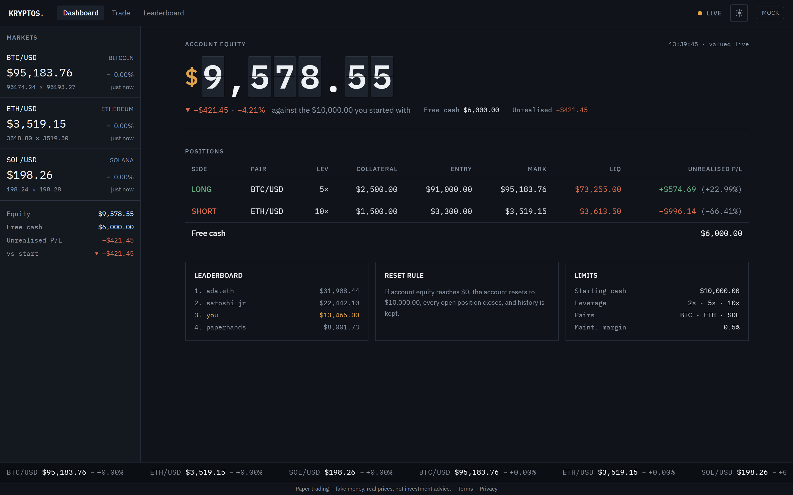

# Kryptos

A crypto **leveraged paper-trading** web app: real-time market prices from Kraken, fake
money, and no real trade ever executes. Open an isolated-margin long or short position
with leverage, watch your equity and unrealized P&L move tick by tick, get liquidated when
the collateral runs out, and climb a live leaderboard.

**Live:** [app.playkryptos.com](https://app.playkryptos.com) · API at
[api.playkryptos.com](https://api.playkryptos.com)

> Fake money, real prices. Nothing here is investment advice and no order ever reaches a
> real market. See [Terms](https://app.playkryptos.com/terms) and
> [Privacy](https://app.playkryptos.com/privacy).



## What it does

- **Email/password auth** with an httponly session cookie.
- Every account starts with a configurable **$10,000** of fake cash.
- **Isolated-margin long/short positions**: pick a pair, a side, USD collateral, and a
  leverage preset (2× / 5× / 10×). The position opens at the live price.
- One open position per pair, no partial closes, no hedged positions.
- Live per-position **unrealized P&L**, a stored **liquidation price**, and account
  **equity** (`free cash + Σ open-position collateral + unrealized P&L`).
- Server-side **marking and automatic liquidation** when a position's equity falls to the
  maintenance margin — every account, every tick, connected or not.
- **Bankruptcy reset**: equity at or below $0 closes every position, restores the starting
  cash, and keeps the history.
- A Redis-backed **leaderboard** ranked by equity.
- Live prices and a read-only OHLC candlestick chart pushed over one **WebSocket**.
- Trading universe: **BTC/USD, ETH/USD, SOL/USD**.

## Architecture

```
  app.playkryptos.com  ──  Vercel (static React SPA, CDN)
        │   fetch(credentials: "include") + WebSocket   (same-site → Lax cookie)
        ▼
  api.playkryptos.com  ──  Render (Docker, one uvicorn --workers 1 instance)
        ├── PostgreSQL ──── Supabase (source of truth: users, cash, positions, ledger)
        └── Redis ───────── Render Key Value (price cache, leaderboard ZSET,
                            open-position index, WS fan-out — all rebuildable)
```

**Single instance is a hard constraint.** The API process runs the price-stream and
leaderboard-refresh asyncio tasks and an in-process WebSocket fan-out, so it must never
scale past one process. See [`docs/deployment.md`](docs/deployment.md).

### Financial correctness

The money path is server-authoritative and defended by invariants (full list in
[`CLAUDE.md`](CLAUDE.md)):

- Free cash never goes negative; an open can't commit more than free cash at execution
  time.
- A position closes exactly once — the `open → closed | liquidated` transition happens
  under `SELECT … FOR UPDATE`, so a user close can't race the liquidator.
- All money math is integer cents or `Decimal`, never float.
- Every state change (position row + ledger entry + cash update + Redis index op) is one
  atomic PostgreSQL transaction.
- Opening is idempotent via a per-account idempotency key with a unique constraint.
- Positions price off the server's Kraken `last` at execution time — never a
  client-supplied price. No cash-mutating action uses a price older than the configured
  max age.

## Tech stack

| Layer | Choice |
|---|---|
| Backend | Python, **FastAPI** (async), Pydantic domain models |
| Database | **PostgreSQL** — SQLAlchemy (async) + asyncpg, Alembic migrations |
| Cache / ephemeral state | **Redis** (leaderboard ZSET, price cache, open-position index) |
| Realtime | **WebSockets** (FastAPI native), in-process fan-out |
| Market data | **Kraken** public REST + WebSocket v2, behind one adapter module |
| Frontend | **React + TypeScript** (strict), Vite, Tailwind CSS v4, SWR, Zustand |
| Charts | lightweight-charts (read-only OHLC) |
| Tests | pytest (backend), Playwright (frontend/e2e) |

## Local development

**Prerequisites:** Docker, Python 3.12+ with [`uv`](https://docs.astral.sh/uv/), Node 20+.

```bash
# 1. Postgres + Redis
docker compose up -d
cp .env.example .env

# 2. Backend  →  http://localhost:8000
cd backend
uv sync
uv run alembic upgrade head
uv run uvicorn app.main:app --port 8000 --reload

# 3. Frontend  →  http://localhost:5173  (Vite proxies the API, so it's same-origin)
cd frontend
npm install
npm run dev
```

Add `?mock` to the frontend URL to run the whole app on a deterministic mock feed with no
backend and no login; `?frozen` also holds animations on one frame (for screenshots).

## Tests & checks

```bash
# Backend
cd backend
uv run ruff check .
uv run mypy app
uv run pytest -m "not network and not benchmark"   # needs the docker compose services

# Frontend
cd frontend
npm run lint
npm run typecheck
npm run build
```

CI ([`.github/workflows/ci.yml`](.github/workflows/ci.yml)) runs all of the above on every
push and pull request.

Tests that touch cash, positions, or liquidation run against a real PostgreSQL test
database — see the concurrency, idempotency, and close-vs-liquidation-race coverage in
`backend/tests/`. Pure money-math tests (`test_positions_math.py`) need no database.

## Benchmarks

Three metrics are backed with real load-test numbers — WebSocket tick-to-client latency,
position open/close throughput under contention, and the Redis price-cache + leaderboard
read path. Plan in [`docs/metrics-benchmark-plan.md`](docs/metrics-benchmark-plan.md),
results in `backend/benchmarks/RESULTS.md`.

## Documentation

| File | What's in it |
|---|---|
| [`CLAUDE.md`](CLAUDE.md) | Authoritative product scope, invariants, and coding expectations |
| [`PRODUCT.md`](PRODUCT.md) | Users, purpose, positioning, product principles |
| [`docs/leverage-model.md`](docs/leverage-model.md) | Position / P&L / margin / liquidation / bankruptcy math |
| [`docs/deployment.md`](docs/deployment.md) | Runbook: Vercel + Render + Supabase, the split-origin cookie model |
| [`docs/metrics-benchmark-plan.md`](docs/metrics-benchmark-plan.md) | The benchmarked metrics and how they're measured |
| [`frontend/README.md`](frontend/README.md) | Frontend architecture and the "trading desk" visual direction |

## Disclaimer

Kryptos is a game. It uses real market prices but fake money, executes no real trades, and
is not a broker, an exchange, or a source of financial advice. Accounts and their data may
be reset or removed at any time. Provided as is, with no warranty.

## License

No license is currently granted — all rights reserved. Contact the maintainer if you'd
like to reuse any part of this.
